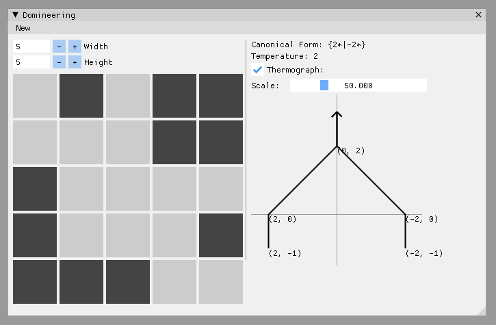
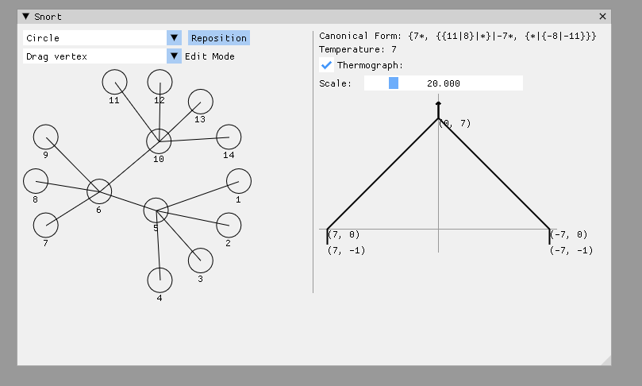

# `cgt_gui`

## Showcase





## Installation

### From source

#### Prerequisites

If using [nix](https://nixos.org/) everything comes in nix shell (`nix develop`) so no need to install anything.

- [pkg-config](https://www.freedesktop.org/wiki/Software/pkg-config/)
- [SDL2](https://www.libsdl.org/) 
- [freetype2](https://freetype.org/).
- [Rust toolchain](https://doc.rust-lang.org/cargo/getting-started/installation.html)

```console
$ cargo run -r -p cgt_gui
```

### Prebuilt bianries (Windows only)

Discalimer: I've tested these only using wine, I don't have Windows machine.

Download zip archive from [releases page](https://github.com/t4ccer/cgt-tools/releases), unpack and run `cgt-gui.exe`. Do not move this file from the directory with .dll files, these are required at runtime.
